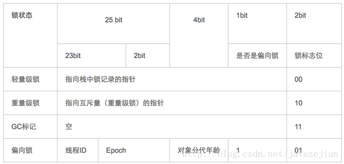

# 并发编程专题 3：synchronized

## 1、synchronized 修饰的几种情形

根据 synchronized 可以被用来修饰的对象可以分成下面几种情形，


## 2、synchronized 的原理

### 2.1 理论基础

Java 虚拟机中的同步 (Synchronization) 基于进入和退出管程 (Monitor) 对象实现，无论是显式同步 (有明确的 `monitorenter` 和 `monitorexit` 指令，即同步代码块)，还是隐式同步都是如此。在 Java 语言中，同步用的最多的地方可能是被 synchronized 修饰的同步方法。同步方法并不是由 monitorenter 和 monitorexit 指令来实现同步的，而是**由方法调用指令读取运行时常量池中方法的 `ACC_SYNCHRONIZED` 标志**来隐式实现的

在 JVM 中，对象在内存中的布局分为三块区域：对象头、实例数据和对齐填充。其中，对象头是实现synchronized 的基础。synchronized 使用的锁对象是存储在 Java 对象头里的，JVM 中采用 2 个字来存储对象头 (如果对象是数组则会分配 3 个字，多出来的 1 个字记录的是数组长度)，其主要由 Mark Word 和 Class Metadata Address 组成。


在默认情况下 Mark Word 的数据结构，


Mark Word 是一个非固定的数据结构，会根据对象自身的状态复用自己的存储空间。如 32 位 JVM 下，还有如下可能变化的结构：



重量级锁也就是 synchronized 的对象锁，锁标识位为 10，其中指针指向的是 monitor 对象（也称为管程或监视器锁）的起始地址。每个对象都存在着一个 monitor 与之关联，对象与其 monitor 之间的关系有存在多种实现方式，如 monitor 可以与对象一起创建销毁或当线程试图获取对象锁时自动生成，但当一个 monitor 被某个线程持有后，它便处于锁定状态。在 Java 虚拟机 (HotSpot) 中，monitor 由 ObjectMonitor 实现，其主要数据结构如下，

```c++
ObjectMonitor() {
    _header       = NULL;
    _count        = 0;     // 记录个数
    _waiters      = 0,
    _recursions   = 0;
    _object       = NULL;
    _owner        = NULL;
    _WaitSet      = NULL;  // 处于wait状态的线程，会被加入到_WaitSet
    _WaitSetLock  = 0 ;
    _Responsible  = NULL ;
    _succ         = NULL ;
    _cxq          = NULL ;
    FreeNext      = NULL ;
    _EntryList    = NULL ; // 处于等待锁block状态的线程，会被加入到该列表
    _SpinFreq     = 0 ;
    _SpinClock    = 0 ;
    OwnerIsThread = 0 ;
  }
```
ObjectMonitor 中有两个队列，_WaitSet 和 _EntryList，用来保存 ObjectWaiter 对象列表( 每个等待锁的线程都会被封装成 ObjectWaiter 对象)，_owner 指向持有 ObjectMonitor 对象的线程，当多个线程同时访问一段同步代码时，首先会进入 _EntryList 集合，当线程获取到对象的monitor 后进入 _Owner 区域并把 monitor 中的 owner 变量设置为当前线程同时 monitor 中的计数器 count 加 1，若线程调用 `wait()` 方法，将释放当前持有的 monitor，owner 变量恢复为null，count 自减 1，同时该线程进入 _WaitSet 集合中等待被唤醒。若当前线程执行完毕也将释放 monitor (锁)并复位变量的值，以便其他线程进入获取 monitor (锁)。

由此看来，monitor 对象存在于每个 Java 对象的对象头中(存储的指针的指向)，synchronized 锁便是通过这种方式获取锁的，也是为什么 Java 中任意对象可以作为锁的原因，同时也是 `notify()/notifyAll()/wait()` 等方法存在于顶级对象 Object 中的原因。

### 2.2 synchronized 代码块的原理

可以通过对编译生成的代码反汇编来了解 synchronized 的作用原理，以下面的代码为例，

```java
public class SyncTest {
    static int i = 0;
    public static void main(String...args) {
        synchronized (SyncTest.class) {
            i++;
        }
    }
}
```

使用如下代码进行反汇编，`javap -c ./SyncTest.class`。反汇编结果，

```
Compiled from "SyncTest.java"
public class me.shouheng.test.SyncTest {
  static int i;

  static {};
    Code:
       0: iconst_0
       1: putstatic     #10                 // Field i:I
       4: return

  public me.shouheng.test.SyncTest();
    Code:
       0: aload_0
       1: invokespecial #15                 // Method java/lang/Object."<init>":()V
       4: return

  public static void main(java.lang.String...);
    Code:
       0: ldc           #1                  // class me/shouheng/test/SyncTest
       2: dup
       3: astore_1
       4: monitorenter                      // 获取锁
       5: getstatic     #10                 // Field i:I
       8: iconst_1
       9: iadd
      10: putstatic     #10                 // Field i:I
      13: aload_1
      14: monitorexit                       // 释放锁
      15: goto          21
      18: aload_1
      19: monitorexit                       // 发生异常时释放锁
      20: athrow
      21: return
    Exception table:
       from    to  target type
           5    15    18   any
          18    20    18   any
}
```

对照 Java 源代码和反汇编之后生成的代码。我们可以看出，同步语句块的实现使用的是`monitorenter` 和 `monitorexit` 指令，其中 monitorenter 指令指向同步代码块的开始位置，monitorexit 指令则指明同步代码块的结束位置。

当执行 monitorenter 指令时，当前线程将试图获取 monitor 的持有权，当 monitor 的计数器为 0，那线程可以成功取得 monitor，并将计数器值设置为 1，取锁成功。如果当前线程已经拥有 monitor 的持有权，那它可以重入这个 monitor，重入时计数器的值也会加 1。倘若其他线程已经拥有 monitor 的所有权，那当前线程将被阻塞。当 monitorexit 指令被执行，执行线程将释放 monitor (锁)并将计数器值减 1，当计数器为 0 时，释放锁，其他线程将有机会持有 monitor。

值得注意的是编译器将会确保方法中调用过的每条 monitorenter 指令都有执行其对应 monitorexit 指令，而无论这个方法是正常结束还是异常结束。为了保证在方法异常时 monitorexit 指令依然可以地执行，编译器会自动产生一个异常处理器。这个异常处理器声明可处理所有的异常，它的目的就是用来执行 monitorexit 指令。从字节码中也可以看出多了一个 monitorexit 指令，它就是异常结束时被执行的释放 monitor 的指令。

### 2.3 synchronized 方法的原理

方法级的同步是隐式的，无需通过字节码指令来控制。JVM 可以从方法常量池中的方法表结构(method_info Structure) 中的 `ACC_SYNCHRONIZED` 访问标志区分一个方法是否同步方法。当调用方法时，调用指令将会检查方法的 ACC_SYNCHRONIZED 访问标志是否被设置，如果设置了，执行线程将先持有 monitor，然后再执行方法，最后再方法完成 (无论是正常完成还是非正常完成) 时释放monitor. 在方法执行期间，其他任何线程都无法再获得同一个 monitor. 如果一个同步方法执行期间抛出了异常，并且在方法内部无法处理此异常，那这个同步方法所持有的 monitor 将在异常抛到同步方法之外时自动释放。

以下面的代码为例，

```java
public class SyncMethod {
    int x;
    public synchronized void syncMethod() {
        x++;
    }
}
```

要输出方法的信息，需要使用指令 `javap -c -verbose ./SyncMethod.class`，于是得输出，

```
  public synchronized void syncMethod();
    descriptor: ()V
    flags: ACC_PUBLIC, ACC_SYNCHRONIZED
  ...
```

ACC_SYNCHRONIZED 标识指明了该方法是一个同步方法。JVM 通过 ACC_SYNCHRONIZED 来辨别一个方法是否声明为同步方法，从而执行相应的同步调用。

在 Java 早期版本中，synchronized 属于重量级锁，效率低下，因为监视器锁（monitor）是依赖于底层的操作系统的 Mutex Lock 来实现的，而操作系统实现线程之间的切换时需要从用户态转换到核心态，这个状态之间的转换需要相对比较长的时间，时间成本相对较高。Java 6 之后，为了减少获得锁和释放锁所带来的性能消耗，引入了轻量级锁和偏向锁，锁效率也得到了优化。

### sychronized & ReentrantLock

除了使用 sychronized，我们还可以使用 JUC 中的 ReentrantLock 来实现同步，它与 sychronized 类似，区别主要表现在以下 3 个方面：

1. 等待可中断：当持有锁的线程长期不释放锁的时候，正在等待的线程可以选择放弃等待。ReentrantLock 使用 CAS 实现，可以在获取锁的时候设置一个超时的时间，当到达了指定的时间仍然没有获取到锁可以放弃获取锁。
2. 公平锁：多个线程等待同一个锁时，必须按照申请锁的时间顺序来依次获得锁；而非公平锁无法保证，当锁被释放时任何在等待的线程都可以获得锁。sychronized 本身时非公平锁，而 ReentrantLock 默认是非公平的，可以通过构造函数要求其为公平的。
3. 锁可以绑定多个条件：ReentrantLock 可以绑定多个 Condition 对象，而 sychronized 要与多个条件关联就不得不加一个锁，ReentrantLock 只要多次调用 newCondition 即可。

## 参考

- 《深入理解Java虚拟机》 
- [深入理解Java并发之synchronized实现原理](https://blog.csdn.net/javazejian/article/details/72828483)
