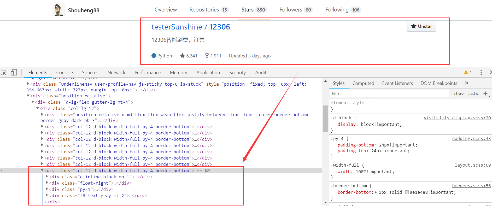
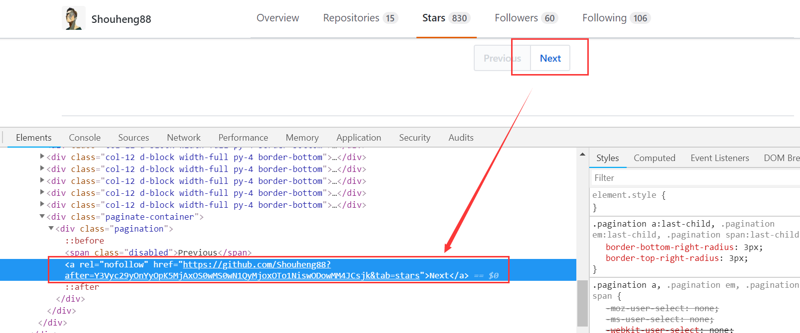
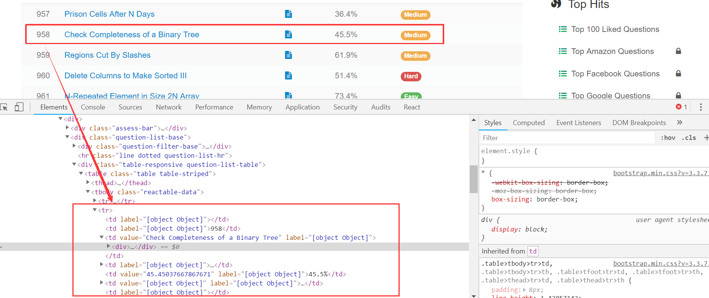
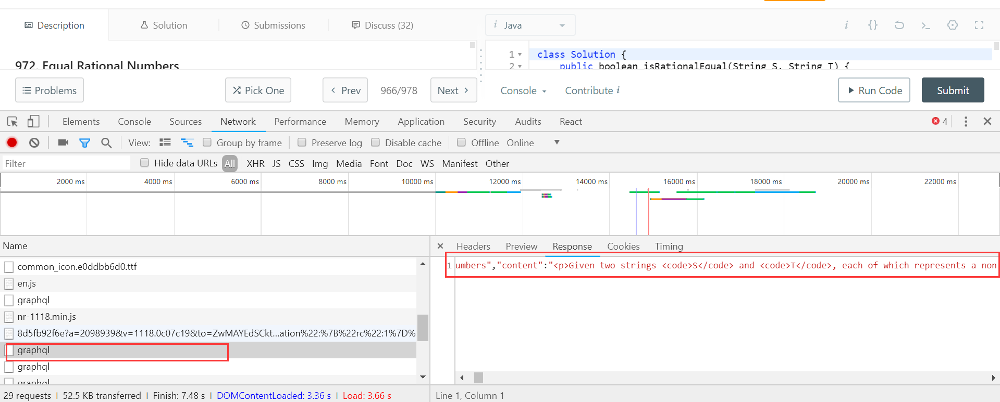

# 是时候 Get 新技能了：使用 Java 爬取网页信息

如果你想利用自己的技术做出一点有意思的产品来，那么爬虫、算法和 AI 等技术可能是一个不错的突破口。今天，我们就来介绍下使用 Java 爬取页面信息的几种思路。

说起爬虫，自从 Python 兴起之后，人们可能更多地使用 Python 进行爬虫. 毕竟，Python 有许多封装好的库。但对于 Javaer，如果你觉得学习 Python 成本比较高的话，使用 Java 也是一个不错的选择，尤其是当你希望在客户端进行爬虫的时候。

在这篇文中我们会以几个页面爬取的小例子来介绍使用 Java 进行爬虫的几种常用的手段。

## 1、使用 Jsoup 整理你的 Github

也许有许多人会像我一样，喜欢 Star 各种有趣的项目，希望某天用到的时候再看。但当你 Star 的项目太多的时候，想要再寻找之前的某个项目就会比较困难。因为寻找项目的时候必须在自己的 Star 列表中一页一页地去翻（国内访问 Github 的速度还比较慢）。你也可以用笔记整理下自己 Star 的项目，但这种重复性的工作，超过三次，就应该考虑用程序来解决了。此外，我们希望寻找自己 Star 过的项目的时候能够像检索数据库记录一样一个 SQL 搞定。所以，我们可以直接爬取 Star 列表并存储到本地数据库，然后我们就可以对这些数据为所欲为了不是？

下面我们开始进行页面信息的抓取。

### 1.1 页面分析

抓取页面信息之前我们首先要做的是分析页面的构成。我们可以使用 Chrome 来帮助我们解决这个问题。方式很简单，打开 Chrome，登入自己的 Github，然后点击页面的 Star 的 Tab 即可。然后，我们在自己的 Star 列表的一个条目上面进行 "检查" 即可，



如图所示，页面的一个 `<div>` 标签就对应了列表中的一个元素。我们可以使用 Jsoup 直接抓取到这个标签，然后对标签的子元素信息进行提取。这样就可以将整个列表中的信息全部检索出来。

页面分析的另一个问题是页面的自动切换，即，因为 Star 列表是分页的，一个页面信息加载完毕之后我们需要让程序自动跳转到下一页进行加载。对于 Github，这个要求是很容易满足的。因为 Github 的 Star 页面完全由服务端渲染完毕之后返回的，所以我们可以在页面中直接找到下一页的链接。



如图所示，我们直接在页面的 Next 按钮上面进行 "检查" 就可以看到，Next 按钮是一个 `<a>` 标签，这里直接包含了下一个页面的链接。

### 1.2 页面分析工具库

页面信息的分析，我们使用 Jsoup 来搞定。Jsoup 是一个基于 Java 的 HTML 解析器。我们可以直接通过在 pom.xml 中引入依赖来使用它，

```xml
        <dependency>
            <groupId>org.jsoup</groupId>
            <artifactId>jsoup</artifactId>
            <version>1.11.3</version>
        </dependency>
```

这里我们使用 Maven 来作为项目的构建工具。如果你希望使用 Gradle 的话，稍微做下转换也是可以的。对于 Jsoup 的使用方式，你可以在其官方网站中进行了解：[https://jsoup.org/](https://jsoup.org/). 

### 1.3 配置数据库

然后，我们需要考虑的是数据的存储的问题。如果爬虫的数据量比较大、对数据库性能要求比较高的话，你可以使用 MySQL 和数据库连接池来提升读写性能。这里我们使用一种简单、轻量的数据库 H2. H2 是一个小型嵌入式数据库，它开源、纯java实现，是关系数据库，小巧且方便，非常适合我们的应用场景。

参考下面的步骤进行安装：[在windows上安装H2数据库](https://jingyan.baidu.com/article/19192ad8d2bccde53e5707db.html)。

然后按照说明的方式打开即可。如果打开的时候发生了错误，需要检查下是否是端口被占用的问题。可以使用 `H2 Console (Command line)` 来打开。如果确实是因为端口占用的问题，参考下面的步骤结束占用端口的程序即可，[如何查看某个端口被谁占用](https://jingyan.baidu.com/article/3c48dd34491d47e10be358b8.html)。

### 1.4 编码

这里我们使用 IDEA 作为开发工具，Maven 作为构建工具。

首先，我们需要引入项目所需的各种依赖。上面我们已经介绍了 Jsoup，为了在项目中使用 H2 数据库，我们还要引入 H2 的数据库驱动，

```xml
        <dependency>
            <groupId>com.h2database</groupId>
            <artifactId>h2</artifactId>
            <version>1.4.197</version>
        </dependency>
```

数据库的读写有许多封装的库，比如常用的 ORM 框架，Hibernate 和 Mybatis 等。这里我们使用原生的数据库读取方式，因为我们的项目比较小并且熟悉这些底层的东西更有益于我们学习和理解上述框架。所以，目前为止，我们需要引用的依赖总计就两个。

然后就是编写代码了。这里，我们首先考虑项目整体的结构。我们没有直接使用消费者生产者模式，而是创建一个由 6 条线程组成的线程池，其中 1 个线程用来做观察，另外 5 条线程执行任务。这 5 条线程会从一个线程安全的队列中取出需要解析的页面链接，并且当它们解析完毕之后会获取到下一个页面的链接并插入到列表中。另外，我们建立了一个对象 Repository 用来描述一个项目。于是代码如下，

```java
    // 线程池
    private static ExecutorService executorService = Executors.newFixedThreadPool(6);

    // 页面链接
    private static BlockingQueue<String> pages = new ArrayBlockingQueue<>(10);

    // 解析历史信息
    private static List<String> histories = Collections.synchronizedList(new LinkedList<>());

    // 解析出的项目记录
    private static List<Repository> repositories = Collections.synchronizedList(new LinkedList<>());

    // 布尔类型，用来标记是否解析完最后一页
    private static AtomicBoolean lastPageParsed = new AtomicBoolean(false);

    public static void main(String...args) {
        // 启动监控线程
        executorService.execute(new Watcher()); 
        // 启动解析线程
        executorService.execute(new Parser("https://github.com/" + USER_NAME + "?tab=stars"));
    }

    private static class Parser implements Runnable {

        private final String page;

        private Parser(String page) {
            this.page = page;
        }

        @Override
        public void run() {
            try {
                // 停顿一定时间
                Thread.sleep(DELAY_MILLIS);
                // 开始解析
                doParse();
            } catch (InterruptedException | IOException | ParseException e) {
                e.printStackTrace();
            }
        }

        private void doParse() throws IOException, InterruptedException, ParseException {
            System.out.println("Start to parse " + page);

            Document doc = Jsoup.connect(page).get();

            // 解析网页信息

            pages.remove(page);
        }
    }

    private static class Watcher implements Runnable {

        @Override
        public void run() {
            try {
                boolean shouldStop = false;
                while (!shouldStop) {
                    // 停顿一定时间，不用检查太频繁
                    Thread.sleep(WATCH_SPAN_MILLIS);
                    if (lastPageParsed.get() && pages.isEmpty()) {
                        // 最终完成，写入数据
                        shouldStop = true;
                        executorService.shutdown();
                        System.out.println("Total repositories " + repositories.size());
                        System.out.println("Begin to write to database......");
                        H2DBWriter.write(repositories);
                    }
                }
            } catch (InterruptedException e) {
                e.printStackTrace();
            }
        }
    }

    // 数据库记录
    public static class Repository { /* ..... */ }
```

然后是数据库读写部分。我们需要先在数据库中执行数据库记录的 SQL，

```sql
     CREATE TABLE REPOSITORY
     (id INTEGER not NULL AUTO_INCREMENT,
     userName VARCHAR(255),
     repoName VARCHAR(255),
     ownerName VARCHAR(255),
     repoLink VARCHAR(255),
     description VARCHAR(1000),
     language VARCHAR(255),
     starNum INTEGER,
     date TIMESTAMP,
     PRIMARY KEY ( id ))
```

然后，是写入数据部分。这里就是将列表中的记录一个个地构建成一条 SQL 并将其插入到数据库中，

```java
    public static void write(List<GithubStarExample.Repository> repositories) {
        Connection conn = null;
        Statement stmt = null;
        try {
            // 设置数据库驱动
            Class.forName(H2DBConfig.JDBC_DRIVER);
            // 获取数据库连接，需要驱动和账号密码等信息
            conn = DriverManager.getConnection(H2DBConfig.DB_URL, H2DBConfig.USER, H2DBConfig.PASS);
            stmt = conn.createStatement();
            // 遍历进行写入
            for (GithubStarExample.Repository repository : repositories) {
                PreparedStatement preparedStatement = conn.prepareStatement("INSERT INTO REPOSITORY (userName, repoName, ownerName, repoLink, description, language, starNum, date) VALUES (?, ?, ?, ?, ?, ?, ?, ?)");
                preparedStatement.setString(1, repository.userName);
                preparedStatement.setString(2, repository.repoName);
                preparedStatement.setString(3, repository.ownerName);
                preparedStatement.setString(4, repository.repoLink);
                preparedStatement.setString(5, repository.description);
                preparedStatement.setString(6, repository.language);
                preparedStatement.setInt(7, repository.starNum);
                preparedStatement.setString(8, new SimpleDateFormat("yyyy-MM-dd HH:mm:ss").format(repository.date.getTime()));
                preparedStatement.execute();
            }
            System.out.println("Database writing completed!");
            // 关闭数据库连接
            stmt.close();
            conn.close();
        } catch(Exception e) {
            e.printStackTrace();
        } finally {
            try{
                if(stmt != null) stmt.close();
            } catch(SQLException se2) {
                se2.printStackTrace();
            }
            try {
                if(conn != null) conn.close();
            } catch(SQLException se) {
                se.printStackTrace();
            }
        }
    }
```

至于数据库读取部分，我们不详细叙述了。你可以通过查看源码来自行了解。

最后是测试阶段，注意需要先关闭之前打开的页面客户端，然后再进行测试。

### 1.5 小结

上面我们只是简单介绍了爬虫的一些基本的内容，当然，以上各个部分都可能存在一些欠缺。比如数据库读写性能比较低，以及执行 HTML 解析过程中线程池的利用率问题。毕竟上述只是一个小的示例，如果读者对读写和其他性能有更高的要求，可以按照之前说的，加入数据库连接池，并优化线程池的效率等。

## 2、使用 PhantomJs + Selenium 抓取页面信息

### 2.1 分析

上面我们使用的是 Jsoup 来抓取页面信息，它可以解决一部分问题。对于由前端渲染的网页它就无计可施了。所谓前端渲染就是指，页面加载出来之后或者当用户执行了某些操作之后，比如页面滚动等，再进行数据加载。对应地，后端渲染主要是指服务端把页面渲染完毕之后再返回给客户端。

我们可以以抓取 LeetCode 的题目信息为例。

之前，为了随时随地查看 LeetCode 上面的题目，我希望将它们从页面上面拉取下来，保存到本地数据库，以便在移动端和其他设备上面离线查看。我分析了它的题目列表页面，



如图所示，按照上面的分析，当我们使用 Jsoup 获取 class 为 `reactable-data` 的元素的时候，可以很容易地取出题目的列表元素。然而事实并不像我们想象地那么简单。因为我发现，当使用 Jsoup 加载完毕的时候，整个元素列表为空。这是因为，整个列表实际是有客户端发起一个请求，拿到一个 json 之后，通过解析 json 把一个个列表项目构建出来的。

所以，我换了另外一种解决方式，即使用 Chrome 的 Network 监听，获取该页面访问服务器的请求链接。（这种由前端渲染的页面可以先考虑使用这种方式，它更简单，你甚至不需要使用 Jsoup 解析 HTML.） 


如图，这样我们就轻松拿到了获取所有题目的请求的链接。吐槽一下，这个请求竟然返回了全部 900 多道题目，整个 json 的字符长度长达 26 万……不管怎样，我们拿到了所有题目的请求的链接。

但只有链接还是不够的，我们还希望获取所有题目的描述，最好把整个标签全部抓下来。

此时，我们又遇到了上述的问题，即 LeetCode 的题目的页面也是又前端渲染的。不过我还是能找到它的请求地址，



当我拿到了这个请求之后到 Postman 里面调试了一下，发现这个链接使用了 Referer 字段用来防盗链。没办法，直接从访问该请求获取描述信息遇到了障碍。此时，我想到了几种解决办法。

第一，按照很多人说的，使用 HtmlUnit，然而我到 github 看了一下这个项目，只有 83 个 Star，尝试了一下还出现了 SOF 的错误，所以，只能放弃，

第二，使用 PhantomJs. 这应该算是一种终结的解决办法了。PhantomJs 用来模拟 JS 调用，配合 Selenium，可以用来模拟浏览器请求。这样我们可以等前端渲染完成之后获取到完整的 HTML. 

### 2.2 编码

按照上面的描述，我们需要在项目中另外引入几个依赖。首先对于从服务器返回的 Json 的问题，我们使用 OkHttp + Retrofit 来自动映射。因此，我们需要引入如下的依赖，

```xml
        <dependency>
            <groupId>com.squareup.okhttp3</groupId>
            <artifactId>okhttp</artifactId>
            <version>3.11.0</version>
        </dependency>
        <dependency>
            <groupId>com.squareup.retrofit2</groupId>
            <artifactId>retrofit</artifactId>
            <version>2.4.0</version>
        </dependency>
        <dependency>
            <groupId>com.squareup.retrofit2</groupId>
            <artifactId>converter-gson</artifactId>
            <version>2.4.0</version>
        </dependency>
        <dependency>
            <groupId>com.squareup.retrofit2</groupId>
            <artifactId>adapter-rxjava2</artifactId>
            <version>2.4.0</version>
        </dependency>
```

这里引入了 OkHttp 进行网络访问，引入了 Retorfit 以及对应的请求转换器和适配器，用来将请求转换成 RxJava2 的形式。

另外，我们还需要引入 PhantomJs 和 Selenium，

```xml
        <dependency>
            <groupId>org.seleniumhq.selenium</groupId>
            <artifactId>selenium-java</artifactId>
            <version>3.9.1</version>
        </dependency>
        <dependency>
            <groupId>com.codeborne</groupId>
            <artifactId>phantomjsdriver</artifactId>
            <version>1.4.4</version>
        </dependency>
```

对于这两个依赖，我使用的是 2018 年 2-3 月发布的版本。早期的版本可能会存在一些 Bug，另外就是注意它们之间的版本的搭配问题。

这样，我们就完成了依赖的引用。然后，我们先写请求 Json 部分的代码，

```java
    // 服务端接口封装
    public interface ProblemService {

        @GET("problems/all/")
        Observable<AllProblems> getAll();
    }

    // 获取全部题目
    private static void getAllProblems() {
        ProblemService service = new Retrofit.Builder()
                .baseUrl(BASE_URL)
                .addCallAdapterFactory(RxJava2CallAdapterFactory.create())
                .addConverterFactory(GsonConverterFactory.create())
                .build()
                .create(ProblemService.class);
        Disposable d = service.getAll()
                .subscribe(System.out::println);
    }
```

这样我们就拿到了整个题目列表。然后，我们需要对题目的内容进行解析。

对于每个题目的内容的链接的构成是，`https://leetcode.com/problems/题目对应的question__title_slug/`。我们可以使用上述请求的结果直接构建出题目的链接。

```java
    private static void testPhantomJs() throws IOException {
        System.setProperty("phantomjs.binary.path", "D://Program Files/phantomjs-2.1.1/bin/phantomjs.exe"); // 这里写你安装的phantomJs文件路径
        WebDriver webDriver = new PhantomJSDriver();
        ((PhantomJSDriver) webDriver).setErrorHandler(new ErrorHandler());
        webDriver.manage().timeouts().implicitlyWait(30, TimeUnit.SECONDS);
        webDriver.get(PROBLEM_CONTENT_TEST_URL);
//        WebElement webElement = webDriver.findElement(By.className("recommended-authors"));
        System.out.println(webDriver.getPageSource());
    }
```

上面就是 PhantomJs + Selenium 请求执行的过程，如以上输出正确结果，则我们就可以直接对得到的 HTML 的内容进行解析了。解析的时候不论使用 Jsoup 还是使用 Selenium 提供的一些方法皆可。

当然，使用 PhantomJs 之前需要先进行安装才行。直接通过 [http://phantomjs.org/download.html](http://phantomjs.org/download.html) 进入下载页面下载并安装即可。

### 2.3 小结

这里我们介绍了使用 PhantomJs + Selenium 抓取由前端渲染的页面的步骤。这种类型的页面主要就两种方式吧，一个是尝试直接拿到前端请求的链接，一个是直接使用 PhantomJs + Selenium 模拟浏览器拿到 HTML 之后再解析。

## 总结

以上就是我们常用的两种抓取页面信息的方式。掌握了这些技能之后你就可以使用它来抓取网上的信息，做出一些好玩的东西了。

如有疑问，欢迎评论区交流 :)


